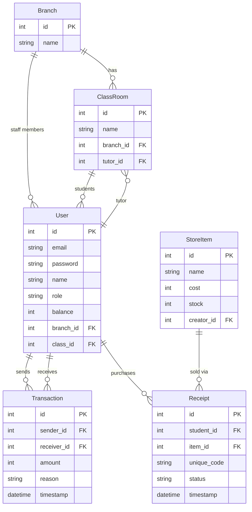

# 💰 ScholarCash v2

> A school‑based virtual‑currency platform where staff reward students with coins that can be spent in an in‑app store — built with Flask & SQLite.

   

---

## 📌 Overview

ScholarCash v2 lets a school run its own micro‑economy:

1. The **Principal** mints coins and distributes budgets to staff.
2. **HODs** allocate portions of their budget to branch teachers.
3. **Teachers / Tutors** reward students with coins for academic performance & behaviour.
4. **Students** accumulate coins and redeem them for real items in the school store.

Every transaction is recorded, every purchase generates a unique receipt code, and each student gets a personal QR code for identification.

---

## ✨ Key Features

| Area | Details |
|---|---|
| **Role‑Based Access** | 4 roles — Principal, HOD, Teacher/Tutor, Student — each with a dedicated dashboard |
| **Coin Economy** | Mint → Allocate → Reward → Spend lifecycle with full transaction history |
| **In‑App Store** | Principal creates items; students buy them; unique receipt codes are generated |
| **QR Codes** | Auto‑generated per‑student QR codes for quick identification |
| **Mobile Dashboard** | Teachers on mobile devices are auto‑redirected to a touch‑optimized transfer page |
| **Self‑Registration** | Students can register themselves and pick their class |
| **CRUD Management** | Principal can create, edit, and delete branches, classes, staff, and store items |

---

## 🏗 Project Structure

```
ScholarCash_v2/
├── app.py                   # Flask routes & business logic
├── models.py                # SQLAlchemy models
├── config.py                # App configuration
├── requirements.txt         # Python dependencies
├── vercel.json              # Vercel deployment config
├── templates/
│   ├── base.html            # Shared layout
│   ├── index.html           # Landing page
│   ├── login.html           # Login page
│   ├── register.html        # Student self‑registration
│   ├── edit_item.html       # Universal edit form
│   ├── mobile_transfer.html # Mobile‑optimized coin transfer
│   ├── db_offline.html      # Shown when DB is unavailable (preview mode)
│   ├── dashboards/
│   │   ├── principal.html   # Admin dashboard
│   │   ├── teacher.html     # Teacher / Tutor / HOD dashboard
│   │   └── student.html     # Student dashboard & store
│   └── store/
│       └── receipt.html     # Purchase receipt page
├── static/
│   ├── css/
│   │   └── landing.css      # Landing page styles
│   └── js/
│       └── html5-qrcode.js  # QR code scanning library
└── instance/
    └── scholarcash_v2.db    # SQLite database (auto‑created on first run)
```

---

## 🗄 Database Models



---

## 🚀 Getting Started

### Prerequisites

- **Python 3.10+**
- **pip**

### Installation

```bash
# 1. Clone the repo
git clone https://github.com/pyhcho099/ScholarCashv2.git
cd ScholarCashv2

# 2. (Recommended) Create a virtual environment
python -m venv venv
# Windows
venv\Scripts\activate
# macOS / Linux
source venv/bin/activate

# 3. Install dependencies
pip install -r requirements.txt
```

### Run the App

```bash
python app.py
```

The server starts at **http://localhost:5000**.

### Default Login

| Role | Email | Password |
|---|---|---|
| Principal | `principal@school.com` | `admin` |

> [!IMPORTANT]
> Change the default principal password and the `SECRET_KEY` in `app.py` before any real deployment.

---

## 👤 User Roles & Permissions

### Principal (Admin)
- Mint coins and allocate budgets to staff
- Create & manage **Branches**, **Classes**, **Staff**, and **Store Items**
- Edit or delete any entity
- View total coin circulation

### HOD (Head of Department)
- View branch‑level statistics (students, teachers, classes, total balance)
- Allocate coins from their budget to teachers in the same branch
- Reward students in their branch

### Teacher / Tutor
- Transfer coins to students within their branch or assigned class
- **Tutors** can also add new students directly to their class
- Auto‑redirected to a mobile‑friendly transfer page on phones/tablets

### Student
- View coin balance and transaction history
- Browse and buy items from the school store
- View purchase receipts with unique codes
- Personal QR code for identification
- Self‑register at `/register`

---

## 🛠 Tech Stack

| Layer | Technology |
|---|---|
| Backend | Python · Flask 3.0 |
| Auth | Flask‑Login · Werkzeug password hashing |
| Database | SQLite via Flask‑SQLAlchemy |
| QR Codes | `qrcode` + Pillow (generation) · html5‑qrcode (scanning) |
| Frontend | Jinja2 templates · HTML · CSS · JavaScript |

---

## 📄 Route Map

| Method | Route | Auth | Description |
|---|---|---|---|
| GET | `/landing` | — | Landing page |
| GET/POST | `/login` | — | Login page |
| GET/POST | `/register` | — | Student self‑registration |
| GET | `/logout` | ✅ | Log out |
| GET | `/principal` | Principal | Admin dashboard |
| POST | `/principal/add_branch` | Principal | Create a branch |
| POST | `/principal/add_class` | Principal | Create a class |
| POST | `/principal/add_staff` | Principal | Create a staff user |
| POST | `/principal/add_item` | Principal | Add store item |
| POST | `/principal/mint` | Principal | Mint & allocate coins |
| GET | `/teacher` | Staff | Teacher/Tutor/HOD dashboard |
| POST | `/teacher/transfer` | Staff | Transfer coins to student |
| POST | `/hod/allocate` | HOD | Allocate coins to teacher |
| POST | `/tutor/add_student` | Tutor | Add student to class |
| GET | `/student` | Student | Student dashboard & store |
| GET | `/student/qr_image` | Student | Get personal QR code PNG |
| GET | `/student/buy/<id>` | Student | Purchase a store item |
| GET/POST | `/edit/<type>/<id>` | Principal/Tutor | Edit user, branch, class, or store item |
| GET | `/delete/<type>/<id>` | Principal | Delete any entity |
| GET | `/mobile` | Staff | Mobile‑optimized dashboard |
| POST | `/mobile/transfer` | Staff | Transfer coins (mobile) |

---

## 🌐 Deployment

See [DEPLOYMENT.md](./DEPLOYMENT.md) for full instructions on deploying to Vercel (preview) or a production server with PostgreSQL.

---

## Contributing

We welcome contributions from everyone. To get started, please check the issues for open tasks or features. If you wish to contribute, please fork the repository and submit a pull request with your changes.

## Environment Variables

To run this application, you will need to set up the following environment variables:  
- `DATABASE_URL`: URL to your database  
- `API_KEY`: Your API key for external services  
- `DEBUG`: Set to 'true' for development.

## Troubleshooting

If you encounter issues running the application, please verify the following:  
- Ensure all dependencies are installed correctly.  
- Check your environment variables for correctness.
- If its runtime error create an issue.

## 📜 License

This project is developed as a **college/minor project** and is provided as‑is for educational purposes.
